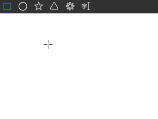
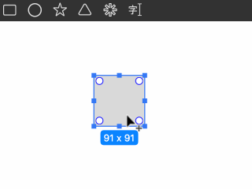
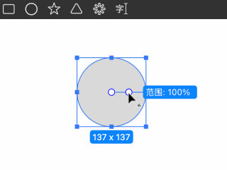
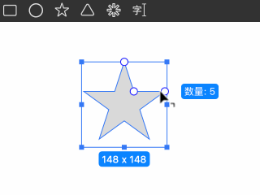
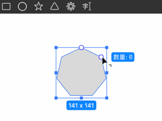
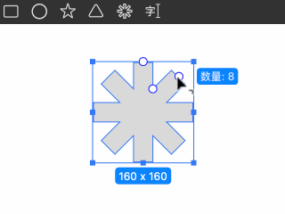

# Drawing Primitives

Primitives include rectangles, circles, stars, polygons, and gears.

## Drawing

- Click and drag on the canvas to draw a primitive shape.
- Hold **⇧ Shift** while drawing to enable proportional scaling.
- Hold **⌥ Option** to draw the shape from its center.
- Press **␣ Spacebar** to move the shape while drawing.

## Editing

After selecting a primitive, draggable control points will appear for adjusting its properties:

- **Rectangle**: Adjust the corner radius for each corner. Hold **⌥ Option** to toggle between individual and unified corner radius adjustment modes.

- **Circle**: Adjust the inner radius of the ring or modify the start and end angles of a sector.

- **Star**: Adjust the corner radius of the star tips, the number of edges, and the indentation ratio.

- **Polygon**: Adjust the number of sides and the corner radius.

- **Gear**: Adjust the number of teeth, the thickness of the edges, and the shrinkage ratio.
