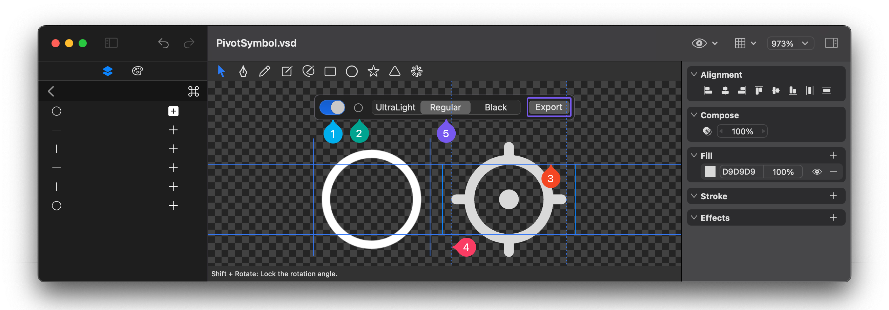

# Creating SFSymbols

## Creating

1. Select a shape layer, right-click, and choose **"Make SFSymbol"** from the menu to convert the selected layer into an SFSymbol.
2. Double-click the shape layer to enter shape editing mode. Click the mode menu in the top-right corner of the curve list and select **"SFSymbol"** to switch the current shape layer to SFSymbol mode.

## Adjustments

In the curve list, each curve has a mode toggle button on its right side, which can be used to change the curve mode. The following modes are supported:

1. **Fill Add**: Applicable to closed curves. This mode combines curves using Boolean "Add" operations when generating SFSymbols.
2. **Fill Subtract**: Applicable to closed curves. This mode combines curves using Boolean "Subtract" operations when generating SFSymbols.
3. **Stroke Add**: This mode combines curves using Boolean "Add" operations, with the stroke thickness and style defined by the SFSymbol stroke properties.
4. **Stroke Subtract**: This mode combines curves using Boolean "Subtract" operations, with the stroke thickness and style defined by the SFSymbol stroke properties.

### Configuration

1. In the SFSymbol configuration panel, click the toggle on the left to enable SFSymbol configuration adjustments.
2. Click the icon to the right of the toggle to select a reference SFSymbol for comparison with the current symbol.
3. Drag the alignment baseline on the canvas to adjust the icon's size to match the reference SFSymbol.
4. Drag the guide lines on the left and right sides of the icon on the canvas to determine the SFSymbol's width (this value is usually correct by default).
5. Click the **"Ultralight"**, **"Regular"**, and **"Bold"** buttons at the top to adjust the properties for different weights to align them with the reference SFSymbol:
   - For curves in **Fill Add** and **Fill Subtract** modes, scale the curves to fit the correct size.
   - For curves in **Stroke Add** and **Stroke Subtract** modes, adjust the stroke scaling ratio in the Symbol variation properties to fit the correct stroke thickness.

## Exporting

Click the export button on the right side of the SFSymbol configuration panel to export the SFSymbol.
