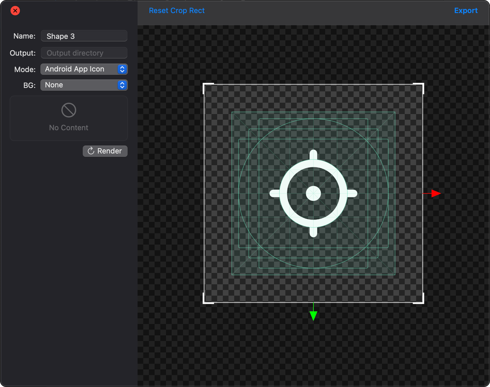
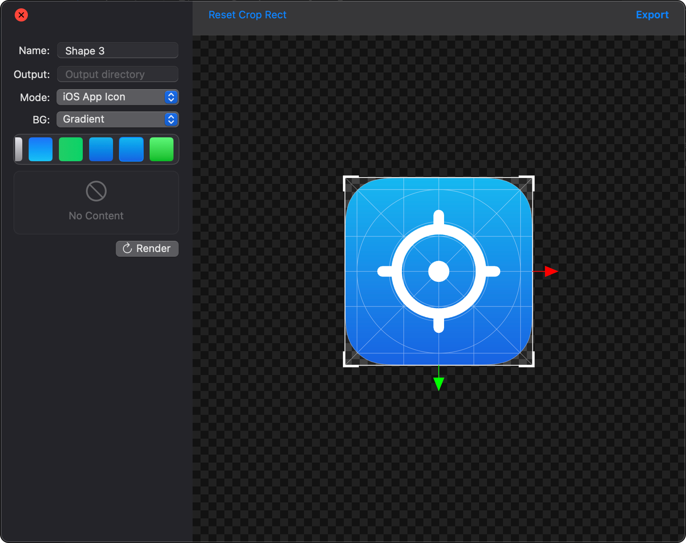
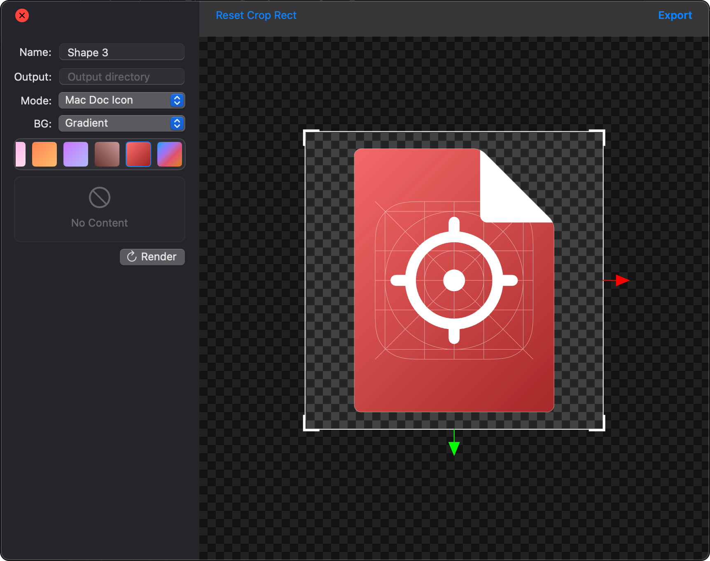
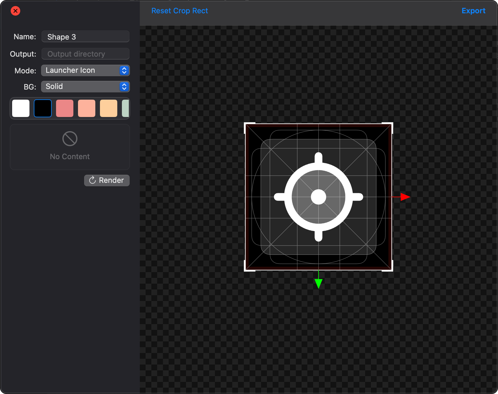
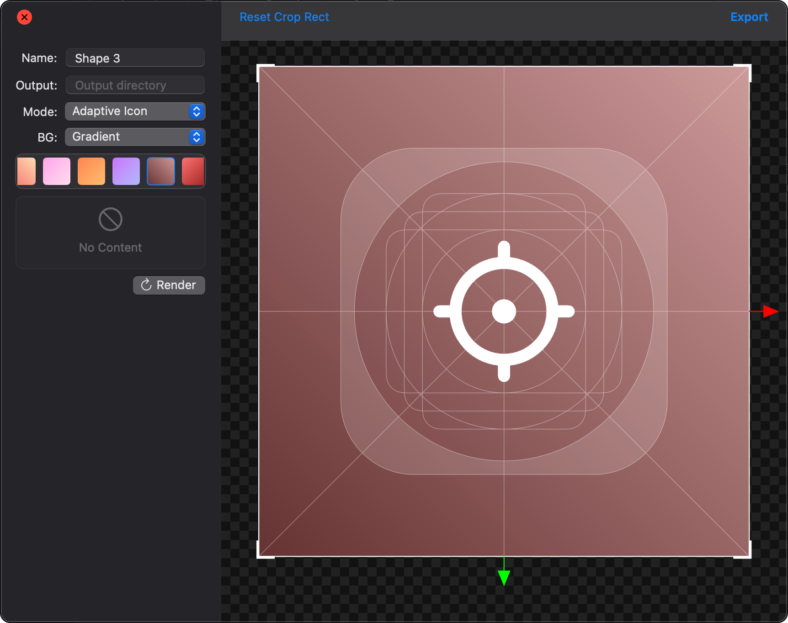
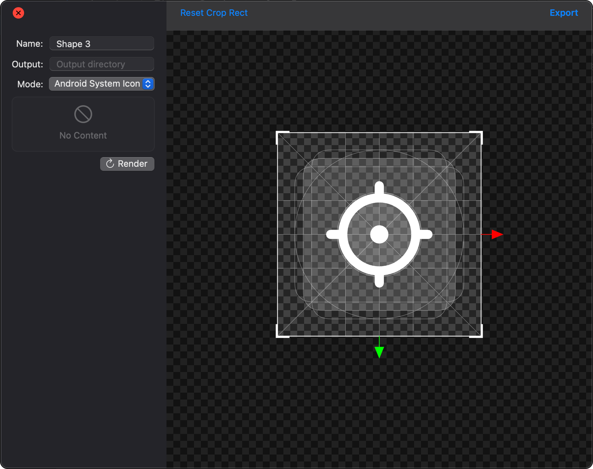

# Exporting

When no layers are selected, right-click on the canvas and select **"Export..."** to open the export panel. If layers are selected, choose **"Export Selection..."** instead.  
There are two types of exporting: **Custom Export** and **Template Export**.  
To export an image, you can directly click the **“Export”** button on the toolbar or use the **“Render”** button in the configuration panel, then drag the rendered file to the target folder.

---

## Custom Export

### Available Types

1. **Crop Size**  
   The export size is determined by the crop area.  
   - **Guides**: Use guides to assist in alignment.
   - **Presets**: Use predefined sizes for export.
   - **Width/Height**: Manually set the width and height of the exported image.
   - **Image Format**: Choose between PNG or SVG format.
   - **Base Scale**: Adjust the image size based on a base scaling factor before exporting.
   - **Platform**: Export images for iOS or Android platforms.

2. **Margin**  
   The export size is determined by the image size on the canvas plus the specified margin.  
   - **Left/Right/Top/Bottom**: Set the margin width (negative values are allowed).
   - Other parameters are the same as for crop configuration.

3. **Fixed Size**  
   The export size is specified directly in the configuration, suitable for fixed-size export requirements.  
   - **Width/Height**: Define the dimensions of the exported image.

4. **Fixed Ratio**  
   The export size is based on the image size on the canvas while maintaining a fixed aspect ratio.  
   - **Ratio**: Set the width-to-height ratio (presets available).

5. **Mouse Cursor**  
   When exporting a mouse cursor image, the size is determined by the image size on the canvas.  
   - Drag the cursor anchor point on the canvas to the correct position.

---

## Template Export

Switching to template export mode will render the corresponding template guides on the canvas. Adjust the size and position of the guides to fit the icon and select a preset background style before exporting.  

Supported templates include:  

- **[Android App Icon](https://developer.android.com/distribute/google-play/resources/icon-design-specifications?hl=zh-cn)**: Supports background presets.

- **[iOS App Icon](https://developer.apple.com/design/human-interface-guidelines/app-icons)**: Supports background presets.

- **[Mac Dock Icon](https://developer.apple.com/news/?id=5i6jlf4d)**: Supports background presets.

- **[Launcher Icon](https://m2.material.io/design/iconography/product-icons.html#grid-and-keyline-shapes)**: Supports background presets.

- **[Adaptive Icon](https://medium.com/google-design/designing-adaptive-icons-515af294c783)**: Supports background presets.

- **[Android System Icon](https://m2.material.io/design/iconography/system-icons.html#design-principles)**  

- **[Font Icon](https://fontawesome.com/v5/docs/web/use-kits/icon-design-guidelines)**  
