# 绘制贝塞尔曲线

## 绘制曲线

### 绘制

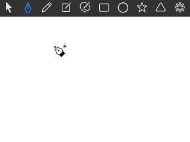

- 在画布空白处单击鼠标添加锚点，单击并拖动可以调整锚点的控制手柄位置。
- 在拖动手柄时，按下 **␣ Spacebar** 键，可以调整刚刚添加的锚点位置。
- 在拖动手柄时，按下 **⌥ Option** 键，可以单边调整手柄位置，用于创建拐点。
- 绘制过程中，将鼠标悬停在起始锚点上，光标会变为封闭曲线提示样式。此时单击即可关闭曲线并结束绘制。按下 **⏎ Return** 键可结束开放曲线的绘制。
- 在绘制过程中，将鼠标悬停在中间锚点上，光标会变为删除锚点提示样式。单击可删除该锚点。

## 编辑曲线

在画布中双击图形（或双击图层列表中的图标）可进入形状编辑模式。在此模式下，可以对曲线进行整体操作，包括复制、删除、镜向、排序和修改形状模式等操作。再次双击曲线，可进入锚点编辑模式，在该模式下可以对锚点进行更精细的操作。

### 选择锚点

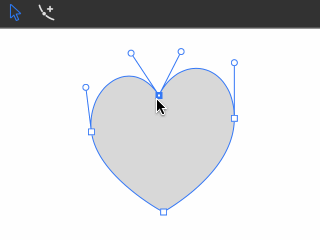

- 单击锚点即可选中该锚点。
- 框选区域即可选中框内的所有锚点。按住 **⇧ Shift** 键框选，可加选锚点。

### 选择曲线段

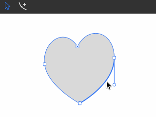

- 鼠标点击曲线段，即可激活该曲线段。
- 框选曲线段（不包含任何锚点），即可激活该曲线段。

### 移动锚点

- 单击未选中的锚点并拖动，可直接移动该锚点。
- 单击已选中的锚点并拖动，可同时移动所有选中的锚点。

### 调整曲率

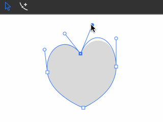

- 选中锚点或曲线段后，与其相关的手柄将被激活。拖动手柄即可调整曲线的曲率。
- 按住 **⌥ Option** 键并拖动手柄，可单边调整手柄位置，用于形成拐点。
- 直接拖动曲线段可快速调整曲线的整体曲率。

### 添加锚点

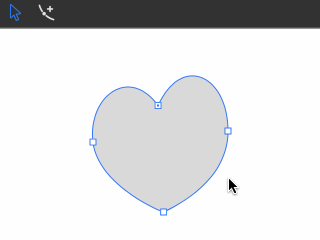

- 在锚点编辑模式下，按住 **⌘ Command** 键，画布中会显示即将添加锚点的位置。单击鼠标左键即可添加锚点，单击并拖动可同时移动新添加的锚点。

### 删除锚点

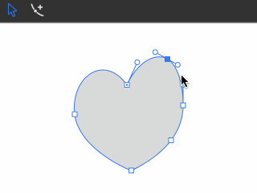

- 选中锚点后，按下 **⌫ Delete** 键，即可删除选中的锚点。
- 如果选中的锚点是连续的，按下 **X** 键可将其合并为一个顶点。

### 转换锚点类型

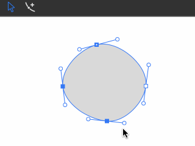

- 按下 **C** 键：将选中的锚点转换为光滑锚点。
- 按下 **V** 键：将选中的锚点转换为角点。

### 精确设置锚点位置

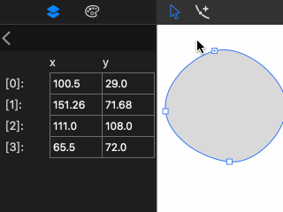

- 选中锚点后，可在左侧锚点列表中直接输入坐标信息，以精确调整锚点位置。
- 在锚点列表中点击并拖动滑过多个输入框，可一次性修改多个锚点的位置。

### 挤压圆弧

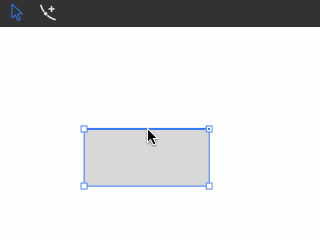

- 在锚点编辑模式下，按住 **⌥ Option** 键可激活最近的曲线边。拖动鼠标可在该位置挤压出圆弧。

### 开放/关闭曲线

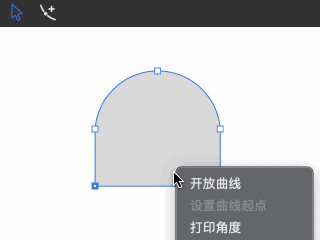

- 对于封闭曲线：选中两个连续的锚点，右键单击，选择 “Open Curve” 菜单即可开放曲线。
- 对于开放曲线：右键单击，选择 “Close Curve” 菜单即可闭合曲线。

### 设置曲线起始点

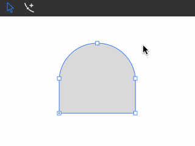

- 选中任意锚点，右键单击，选择 “Set as starting point” 菜单，即可将该锚点设置为曲线的起始点。
