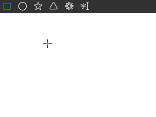
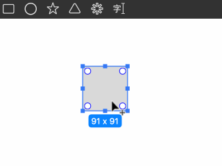
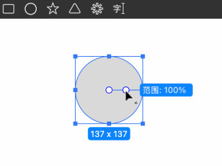
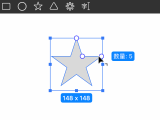
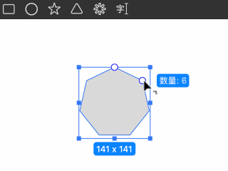
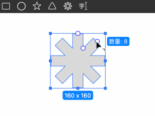

# 绘制几何形

几何形包括：矩形、圆形、星形、多边形和齿轮。

## 绘制

- 在画布中点击并拖动鼠标即可绘制几何形。
- 绘制过程中，按住 **⇧ Shift** 键可启用等比约束。
- 按住 **⌥ Option** 键可从形状中心开始绘制。
- 按下 **␣ Spacebar** 键可在绘制时移动图形的位置。

## 编辑

选中几何形后，会显示可拖动的控制点，用于调整形状属性：

- **矩形**：可调整各角的圆角半径。按住 **⌥ Option** 键可切换为单独调整或整体调整圆角模式。

- **圆形**：可调整圆环的内径比例，或修改扇形的起始和结束角度。

- **星形**：可调整星形尖端的圆角半径、星形边的数量以及缩进比例。

- **多边形**：可调整多边形的边数和圆角半径。

- **齿轮**：可调整齿轮的边数、边的粗细以及收缩比例。
