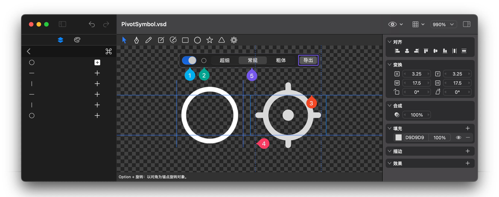

# 制作 SFSymbol

## 制作

1. 选择形状图层，右键单击并从菜单中选择 **"Make SFSymbol"**，即可将选中图层转换为一个 SFSymbol。
2. 双击形状图层进入形状编辑模式。在曲线列表右上角点击模式菜单，选择 **"SFSymbol"**，将当前形状图层转换为 SFSymbol 模式。

## 调整

在曲线列表中，每条曲线右侧都有一个模式切换按钮，可用于更改曲线模式。支持以下四种模式：

1. **填充加**：适用于封闭曲线，表示在生成 SFSymbol 时会通过布尔运算“加”的方式合成。
2. **填充减**：适用于封闭曲线，表示在生成 SFSymbol 时会通过布尔运算“减”的方式合成。
3. **描边加**：表示在生成 SFSymbol 时会通过布尔运算“加”的方式合成，描边的粗细和样式由 SFSymbol 的描边属性决定。
4. **描边减**：表示在生成 SFSymbol 时会通过布尔运算“减”的方式合成，描边的粗细和样式由 SFSymbol 的描边属性决定。

### 配置调节

1. 在 SFSymbol 配置面板中，点击左侧开关以启用 SFSymbol 配置调节。
2. 点击开关右侧的图标，可选择一个参考 SFSymbol，与当前图标进行对比。
3. 在画布中拖动对齐基线，调整图标大小以接近参考 SFSymbol 的大小。
4. 拖动画布中图标左右两侧的参考线，确定 SFSymbol 的宽度（默认情况下，此值通常是正确的）。
5. 点击上方的 **“超细”**、**“常规”** 和 **“粗体”** 按钮，分别调整不同粗细下的属性，使其与参考 SFSymbol 保持协调：
   - 对于 **填充加** 和 **填充减** 模式的曲线，可缩放曲线以正确适配大小。
   - 对于 **描边加** 和 **描边减** 模式的曲线，可修改 Symbol 变化属性中的描边缩放比例，以适配正确的描边粗细。

## 导出

点击 SFSymbol 配置面板右侧的导出按钮，完成 SFSymbol 的导出。

